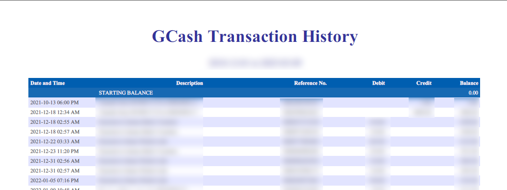

# Convert GCash Transaction History PDF files to CSV/Excel

Coming Soon: online converter

How to use:
1. Must have Python/Python3 installed
2. Run `git clone https://github.com/PagP332/GCash-TransactionHistory-to-CSV.git` or download the ZIP file
3. Open up a terminal within the directory of the repository
4. Run `pip install -r requirements.txt` to get the required dependencies
5. Run `python run.py -d [PDF file directory] -o [output directory of CSV]`
6. NOTE: If PDF is encrypted, or has a password, instead run `python run.py -d [PDF file directory] -o [output directory of CSV] -p [password]`
